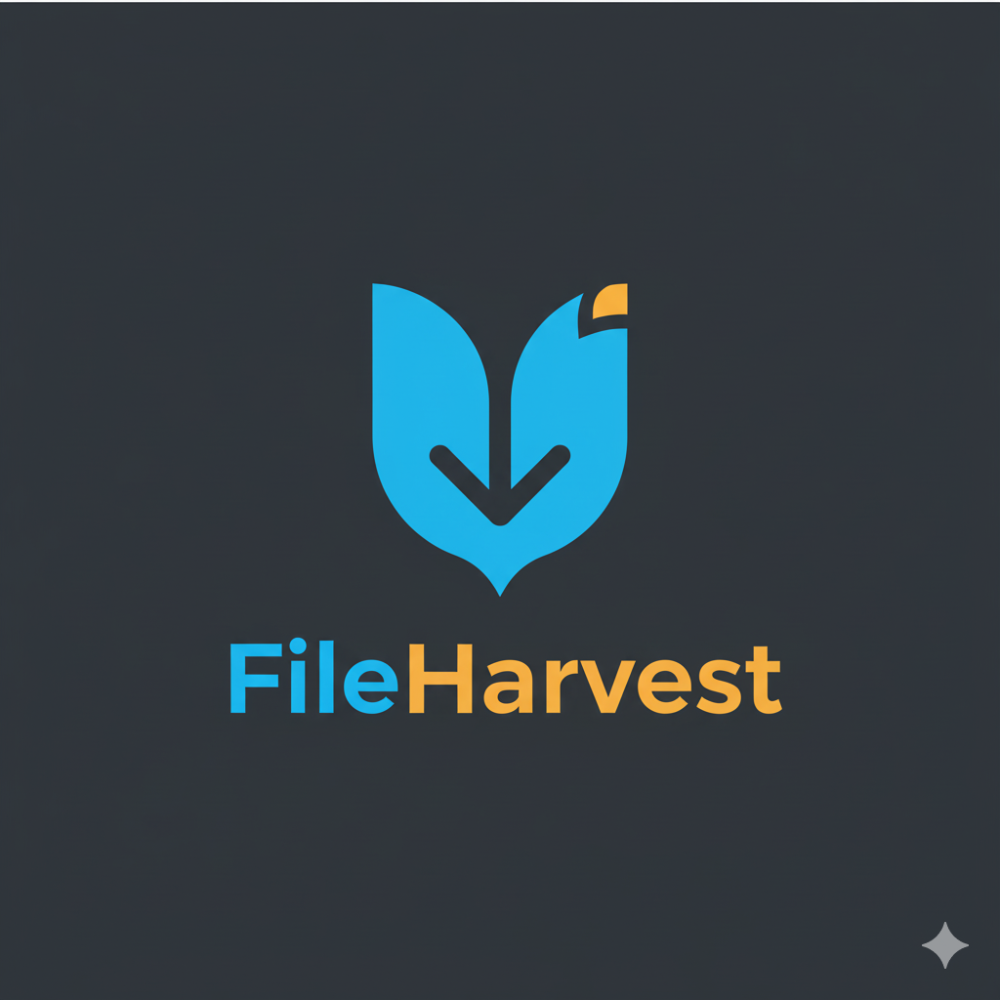

# Promotional Image Guide for Chrome Web Store

La imagen promocional es la pequeña imagen que aparece en la Chrome Web Store junto al nombre de tu extensión.

## Requisitos Técnicos

- **Tamaño exacto**: 440x280 píxeles
- **Formato**: PNG o JPEG
- **Peso**: Máximo 1MB
- **Calidad**: Alta resolución, sin pixelación

## Diseño Recomendado para FileHarvest

### Opción 1: Logo + Texto (Recomendado)
```
┌─────────────────────────────────────────┐
│                                         │
│         [Logo FileHarvest]              │
│                                         │
│           FileHarvest                   │
│    Download Files from Any Webpage      │
│                                         │
└─────────────────────────────────────────┘
```

**Elementos**:
- Background: Degradado oscuro (#1a1a2e a #0f0f1e)
- Logo de FileHarvest centrado (tamaño ~120x120px)
- Texto "FileHarvest" debajo en fuente grande y bold
- Subtítulo "Download Files from Any Webpage" más pequeño

### Opción 2: Feature Showcase
```
┌─────────────────────────────────────────┐
│  📁 FileHarvest                         │
│                                         │
│  ✓ Scan webpages                       │
│  ✓ AI-powered detection                │
│  ✓ Bulk downloads                      │
│                                         │
└─────────────────────────────────────────┘
```

## Cómo Crear la Imagen

### Método 1: Usando Canva (Más Fácil)

1. Ve a https://www.canva.com/
2. Crea un diseño personalizado de 440x280 píxeles
3. Usa estos elementos:
   - Background oscuro (color: #1a1a2e)
   - Sube el logo fileharvest.png
   - Añade texto "FileHarvest" (fuente: Montserrat Bold o similar)
   - Añade subtítulo (fuente: Montserrat Regular)
4. Descarga como PNG de alta calidad

### Método 2: Usando Photopea (Gratis, Online)

1. Ve a https://www.photopea.com/
2. File > New... > 440 x 280 píxeles
3. Añade background:
   - Gradiente desde #1a1a2e (arriba) a #0f0f1e (abajo)
4. Añade el logo:
   - File > Open & Place... > Selecciona fileharvest.png
   - Redimensiona a ~120x120px
   - Centra horizontalmente
5. Añade texto:
   - Tool > Text Tool
   - "FileHarvest" - 36px, bold, blanco
   - "Download Files from Any Webpage" - 16px, regular, gris claro (#cccccc)
6. File > Export As > PNG

### Método 3: Usando GIMP (Desktop, Gratis)

```bash
# Instalar GIMP
# Windows: https://www.gimp.org/downloads/
# Mac: brew install --cask gimp
# Linux: sudo apt install gimp

# Pasos en GIMP:
1. File > New Image > 440x280
2. Filters > Render > Gradiente
3. File > Open as Layer > fileharvest.png
4. Layer > Scale Layer
5. Tools > Text
6. File > Export As > promotional-440x280.png
```

## Template CSS (si usas HTML/CSS para generar)

```html
<!DOCTYPE html>
<html>
<head>
<style>
  body {
    margin: 0;
    padding: 0;
  }
  .promo {
    width: 440px;
    height: 280px;
    background: linear-gradient(180deg, #1a1a2e 0%, #0f0f1e 100%);
    display: flex;
    flex-direction: column;
    align-items: center;
    justify-content: center;
    font-family: 'Segoe UI', Tahoma, sans-serif;
  }
  .logo {
    width: 120px;
    height: 120px;
    margin-bottom: 20px;
  }
  .title {
    color: white;
    font-size: 36px;
    font-weight: bold;
    margin: 0;
    background: linear-gradient(135deg, #667eea 0%, #764ba2 100%);
    -webkit-background-clip: text;
    -webkit-text-fill-color: transparent;
  }
  .subtitle {
    color: #cccccc;
    font-size: 16px;
    margin: 8px 0 0 0;
  }
</style>
</head>
<body>
  <div class="promo">
    
    <h1 class="title">FileHarvest</h1>
    <p class="subtitle">Download Files from Any Webpage</p>
  </div>
</body>
</html>
```

Para capturar esto como imagen:
1. Abre el HTML en Chrome
2. F12 > Dock to right
3. Ajusta viewport a exactamente 440x280
4. Screenshot la ventana o usa la extensión "Full Page Screen Capture"

## Colores Sugeridos para FileHarvest

- **Background Primary**: #1a1a2e (azul oscuro)
- **Background Secondary**: #0f0f1e (casi negro)
- **Accent Cyan**: #16a2b8 (azul cielo - del logo)
- **Accent Gold**: #f0a500 (dorado - del logo)
- **Text White**: #ffffff
- **Text Gray**: #cccccc

## Ejemplos de Texto Alternativo

Si no te gusta "Download Files from Any Webpage", prueba:

- "Bulk File Downloader for Chrome"
- "Smart File Detection & Download"
- "Find & Download Files Instantly"
- "AI-Powered File Harvesting"
- "Your Bulk Download Solution"

## Checklist Final

Antes de subir la imagen promocional:

- [ ] Tamaño exacto 440x280 píxeles
- [ ] Logo visible y centrado
- [ ] Texto legible (no muy pequeño)
- [ ] Colores acordes a la marca FileHarvest
- [ ] Sin información personal o sensible
- [ ] Guardada como PNG de alta calidad
- [ ] Peso menor a 1MB
- [ ] Se ve bien en fondo claro y oscuro

## Ubicación

Guarda la imagen promocional en:
```
bulk-downloader/store-assets/promotional/tile-440x280.png
```

## Siguiente Paso

Una vez que tengas esta imagen lista junto con los screenshots, estarás listo para completar el formulario de publicación en Chrome Web Store.
